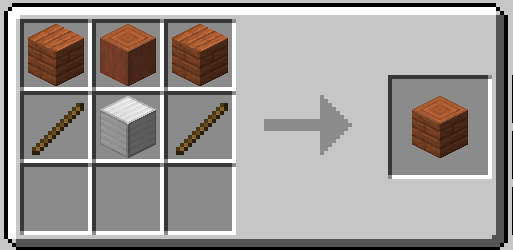

# SimpleAirport
This mod provides a simple way to manage aircraft entities.

1. **Place the `Airport Core` block** on the ground.  
     

2. **Obtain a `Config Stick`** by Shift + Right Clicking the `Airport Core`.  
     
   - Right Click a block with the `Config Stick` to mark it as an **Apron**.  
   - Hold the stick in your **off-hand** and Right Click a block to remove its Apron designation.  
   - Drop the stick to set the block beneath your position as a **Runway**.  

3. **Move your aircraft** (with the engine turned off) onto a runway block. If there is an available Apron, the aircraft will automatically be teleported there.  

4. **Start the aircraft’s engine** while it is in an Apron, and it will automatically be teleported to the runway.  

https://github.com/user-attachments/assets/d6f0107c-0a4a-496c-ae69-15ae2de95f97
